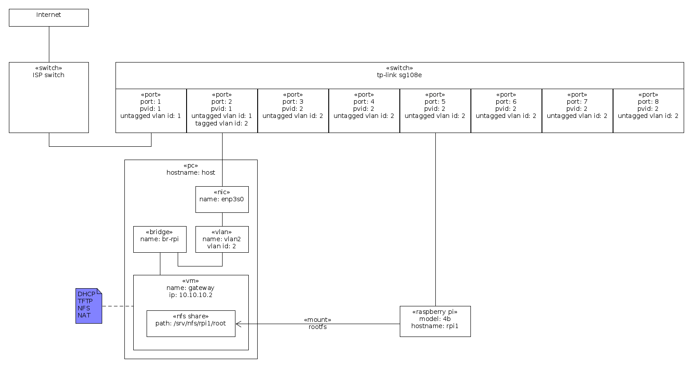
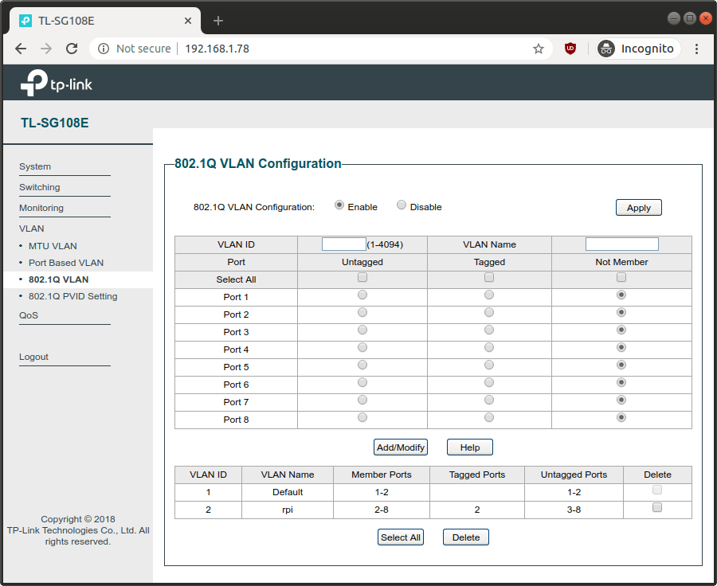
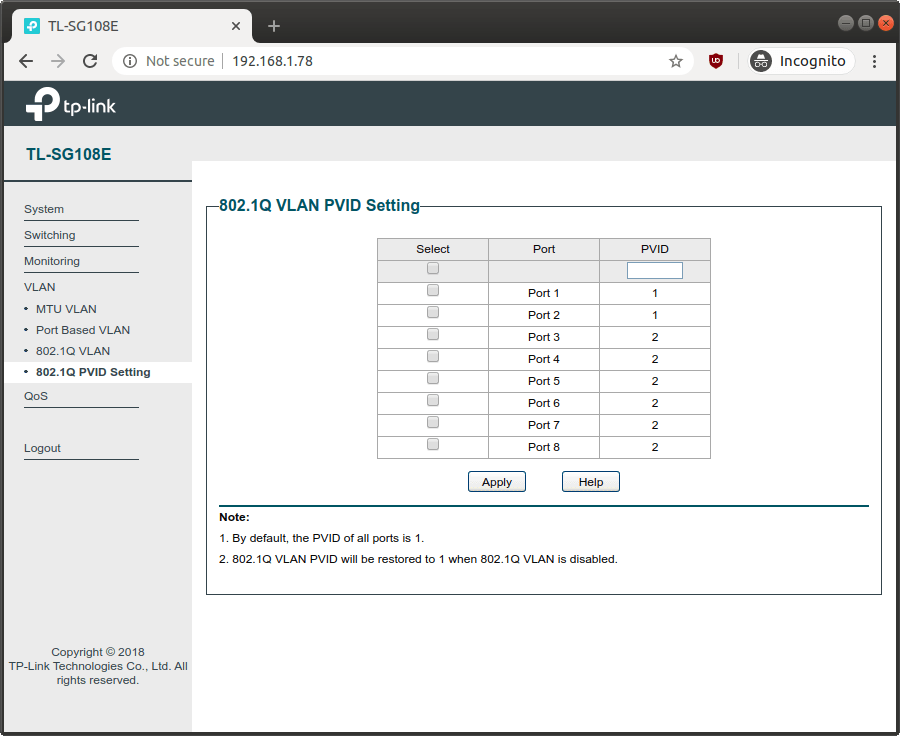

This is a [Vagrant](https://www.vagrantup.com/) Environment for a [Preboot Execution Environment (PXE)](https://en.wikipedia.org/wiki/Preboot_Execution_Environment) gateway for Raspberry Pis.

# Usage

This `gateway` environment is made with isc-dhcp-server (as the DHCP server) and atftpd (as the TFTP server.

In order for it to work you need to connect the `gateway` virtual network to a physical network that reaches the Raspberry Pis.

I'm using Ubuntu 20.04 as the host, qemu/kvm/libvirt has the hypervisor, and a [tp-link tl-sg108e](https://www.tp-link.com/en/business-networking/easy-smart-switch/tl-sg108e/) switch.

The network is connected as:



The tp-link tl-sg108e switch is configured as:




**NB** this line of switches is somewhat insecure as, at least, its configuration protocol (UDP port 29808 and TCP port 80) uses clear text messages. For more information see [How I can gain control of your TP-LINK home switch](https://www.pentestpartners.com/security-blog/how-i-can-gain-control-of-your-tp-link-home-switch/) and [Information disclosure vulnerability in TP-Link Easy Smart switches](https://www.chrisdcmoore.co.uk/post/tplink-easy-smart-switch-vulnerabilities/).

The host network is configured by netplan with `/etc/netplan/config.yaml` as:

```yaml
network:
  version: 2
  renderer: networkd
  ethernets:
    enp3s0:
      dhcp4: yes
      nameservers:
        # NB on ubuntu this normally uses the system-resolved dns resolver and
        #    you can list the current upstream dns server addresses with:
        #       systemd-resolve --status
        addresses:
          # cloudflare+apnic public dns resolvers.
          # see https://en.wikipedia.org/wiki/1.1.1.1
          - "1.1.1.1"
          - "1.0.0.1"
          # google public dns resolvers.
          # see https://en.wikipedia.org/wiki/8.8.8.8
          #- "8.8.8.8"
          #- "8.8.4.4"
  bridges:
    # NB this is equivalent of executing:
    #       ip link add name br-rpi type bridge
    #       ip addr flush dev br-rpi
    #       ip addr add dev br-rpi 10.10.10.1/24
    #       ip link set dev br-rpi up
    #       ip addr ls dev br-rpi
    #       ip -d link show dev br-rpi
    #       ip route
    # NB later, you can remove with:
    #       ip link set dev br-rpi down
    #       ip link delete dev br-rpi
    br-rpi:
      addresses:
        - "10.10.10.1/24"
      interfaces:
        - vlan2
  vlans:
    # NB this is equivalent of executing:
    #       ip link add link enp3s0 vlan2 type vlan proto 802.1q id 2
    #       ip link set dev vlan2 up
    #       ip -d link show dev vlan2
    # NB later, you can remove with:
    #       ip link set dev vlan2 down
    #       ip link delete dev vlan2
    vlan2:
      id: 2
      link: enp3s0
```

After the above is in place, run `vagrant up gateway` to launch the gateway.

For more information about VLANs see the [IEEE 802.1Q VLAN Tutorial](http://www.microhowto.info/tutorials/802.1q.html).

# Raspios sd-card

Create a [Raspios Buster Lite](https://www.raspberrypi.org/downloads/raspios/) sd-card with [balenaEtcher](https://www.balena.io/etcher/), put it in your pi and boot from it.

Login with the `pi` username and `raspberry` password.

Then configure it with:

```bash
# switch to root.
sudo su -l

# disable automatic flash updates.
systemctl mask --now rpi-eeprom-update

# update the system.
apt-get update
apt-get upgrade -y

# reboot.
reboot

# switch to root.
sudo su -l

# disable auto-login.
raspi-config nonint do_boot_behaviour B3

# replace vnc with rdp.
# NB on your computer, you can use the following command to rdp into your pi:
#       xfreerdp /v:raspberrypi.local /u:pi /p:raspberry /size:1440x900 +clipboard
apt-get remove -y --purge realvnc-vnc-server
apt-get install -y xrdp

# remove unneeded packages.
apt-get autoremove -y --purge
```

## Firmware Update for PXE boot

RPi4 has two firmware images:

1. `pieeprom` stored in the SPI-attached FLASH (aka EEPROM; 4MBits/512KB) and used by the SoC as a bootloader. For more information see https://www.raspberrypi.org/documentation/hardware/raspberrypi/booteeprom.md.
2. `vl805` stored in the USB controller FLASH (aka EEPROM) and used by it.

**NB** In theory its not possible to brick the RPi, if something is not working as expected, just use a recovery sdcard as described by the [recovery instructions](https://www.raspberrypi.org/downloads/).

**NB** the RPi4 firmware is not open-source (and probably will never be).

There are two flash image channels:

1. `critical`: contains the stable/finished firmware.
2. `beta`: contains the testing/development firmware (e.g. currently, this is the only one that has support for PXE network booting).

They are stored at `/lib/firmware/raspberrypi/bootloader/*/*.bin` (were installed the `rpi-eeprom-images` package; they are also available at https://github.com/raspberrypi/rpi-eeprom/tree/master/firmware), e.g.:

```plain
    /lib/firmware/raspberrypi/bootloader/beta/pieeprom-2020-04-16.bin
    /lib/firmware/raspberrypi/bootloader/beta/vl805-000137ad.bin
/lib/firmware/raspberrypi/bootloader/critical/pieeprom-2020-04-16.bin
/lib/firmware/raspberrypi/bootloader/critical/vl805-000137ad.bin
```

To flash a image we use the `rpi-eeprom-update` command.

For example, to flash a critical bootloader with its default configuration, use:

```bash
rpi-eeprom-update -d -f /lib/firmware/raspberrypi/bootloader/critical/pieeprom-2020-04-16.bin
reboot
```

**NB** The above will create the following files in the sd-card `/boot` directory:

```plain
-rwxr-xr-x  1 root root       65 Feb  8 16:06 pieeprom.sig*
-rwxr-xr-x  1 root root   524288 Feb  8 16:06 pieeprom.upd*
-rwxr-xr-x  1 root root    60820 Feb  8 16:06 recovery.bin*
```

**NB** The pi 4 rom will always run `recovery.bin` if it exists, that way, the pi can be recovered by using a recovery sd-card.

**NB** The default flashing procedure using `recovery.bin` **only reads files from the sd-card**, even when the pi is configured to boot from the network.

At the next boot, the upgrade will be applied by `recovery.bin` and when it successfully flashes the firmware, it will rename itself. If it fails to rename itself (or a power failure happened), the process repeats it self at the next boot.

For more details see:

* https://github.com/raspberrypi/rpi-eeprom/blob/master/firmware/release-notes.md
* https://www.raspberrypi.org/documentation/hardware/raspberrypi/bcm2711_bootloader_config.md
* https://www.raspberrypi.org/documentation/hardware/raspberrypi/booteeprom.md
* https://leiradel.github.io/2019/01/06/SmartStart.html
* https://leiradel.github.io/2019/01/20/Raspberry-Pi-Stubs.html

See which version you have now by executing `rpi-eeprom-update`, e.g.:

```plain
BCM2711 detected
Dedicated VL805 EEPROM detected
BOOTLOADER: up-to-date
CURRENT: Thu 16 Apr 17:11:26 UTC 2020 (1587057086)
 LATEST: Thu 16 Apr 17:11:26 UTC 2020 (1587057086)
 FW DIR: /lib/firmware/raspberrypi/bootloader/critical
VL805: up-to-date
CURRENT: 000137ad
 LATEST: 000137ad
```

To flash a bootloader with customized settings, e.g., to boot from a PXE server:

```bash
# check the current bootloader version and config.
vcgencmd bootloader_version
vcgencmd bootloader_config

# extract the configuration file.
cp /lib/firmware/raspberrypi/bootloader/critical/pieeprom-2020-04-16.bin pieeprom.bin
rpi-eeprom-config pieeprom.bin >bootconf.txt

# see the configuration file.
cat bootconf.txt
# in my case it was:
#   [all]
#   BOOT_UART=0
#   WAKE_ON_GPIO=1
#   POWER_OFF_ON_HALT=0
#   DHCP_TIMEOUT=45000
#   DHCP_REQ_TIMEOUT=4000
#   TFTP_FILE_TIMEOUT=30000
#   TFTP_IP=
#   TFTP_PREFIX=0
#   BOOT_ORDER=0x1
#   SD_BOOT_MAX_RETRIES=3
#   NET_BOOT_MAX_RETRIES=5
#   [none]
#   FREEZE_VERSION=0

# save a copy to compare after we change it.
cp bootconf.txt{,.orig}

python3 <<'EOF'
import configparser

config = configparser.RawConfigParser()
config.optionxform = str
config.read('bootconf.txt')

# disable wake on GPIO because I do not need it.
# NB default is 1.
config.set('all', 'WAKE_ON_GPIO', '0')

# really power-off everything.
# NB this only leaves the 5v rails on.
# NB this is only applicable when WAKE_ON_GPIO=0,
# NB default is 0.
config.set('all', 'POWER_OFF_ON_HALT', '1')

# enable network boot.
# change BOOT_ORDER from 0x1 (sd-boot) to 0x2 (network boot).
# NB default is 0x1.
# NB if something goes wrong you can always follow the recovery procedure described at https://www.raspberrypi.org/downloads.
# see https://www.raspberrypi.org/documentation/hardware/raspberrypi/bcm2711_bootloader_config.md
config.set('all', 'BOOT_ORDER', '0x2')
# retry forever.
config.set('all', 'NET_BOOT_MAX_RETRIES', '-1')

# identify this RPi as rpi1 to the TFTP server.
config.set('all', 'TFTP_PREFIX', '1')
# request tftp files using this prefix (if that fails, it will try again, without the prefix).
# the bootloader will request the following files (until one of them exists):
#   rpi1/start4.elf
#   rpi1/start.elf
#   config.txt
#   recover4.elf
#   recovery.elf
#   start4.elf
#   start.elf
config.set('all', 'TFTP_PREFIX_STR', 'rpi1/')

# enable the boot UART to help debug (network) boot issues that might arise.
# NB you need a UART/console cable connect to the RPi and to a computer.
#    to connect to the UART use picocom --baud 115200 /dev/ttyUSB0.
#    to quit picocom type Ctrl+A, Ctrl+X.
# NB default is 0.
config.set('all', 'BOOT_UART', '1')

with open('bootconf.txt', 'w') as f:
    config.write(f, space_around_delimiters=False)
EOF

# see the differences to make sure everything is OK.
diff -u bootconf.txt{.orig,}

# apply the configuration change to a new pieeprom-netboot.bin image file.
rpi-eeprom-config --out pieeprom-netboot.bin --config bootconf.txt pieeprom.bin

# flash the pi.
#
# there are two ways to flash the pi:
#
#   1. power-off resilient
#      NB this requires a sd-card to be present.
#   2. non power-off resilient.
#      NB if the power is lost while flashing, you need to recover the flash using the recovery sd-card.
#
# if we have an sdcard, prefer that method, even when booted from the network.
if [ "$(lsblk /dev/mmcblk0p1 -o LABEL | tail -n +2)" == "boot" ]; then
    # configure the device to be flashed at the next boot.
    rpi-eeprom-update -d -f pieeprom-netboot.bin
    # if the sd-card is not mounted we assume we are booting from the network,
    # as such, rpi-eeprom-update left the files in the network share instead
    # of the sd-card, so, we just copy the entire /boot tree to the boot
    # partition.
    sd_card_boot_mountpoint="$(lsblk /dev/mmcblk0p1 -o MOUNTPOINT | tail -n +2)"
    if [ "$sd_card_boot_mountpoint" == '/media/pi/boot' ]; then
        # NB this is normally automatically mounted by raspios, but we
        #    need to re-mount it as root.
        umount /media/pi/boot
        sd_card_boot_mountpoint=''
    fi
    if [ "$sd_card_boot_mountpoint" == "" ]; then
        # when the current system boots from the network we must put the
        # files in the sd-card boot partition (because the pi bootloader
        # can only load them from the sd-card).
        mkdir -p /media/pi-boot
        mount /dev/mmcblk0p1 /media/pi-boot
        rsync -a --delete /boot/ /media/pi-boot/
        umount /media/pi-boot
        rmdir /media/pi-boot
    fi
else
    # flash it right now.
    rm -f /boot/{recovery.bin,pieeprom.*}
    USE_FLASHROM=1 rpi-eeprom-update -d -f pieeprom-netboot.bin
fi

# reboot to apply changes.
reboot
```

After reboot you should verify that the device is using the expected bootloader configuration:

```bash
vcgencmd bootloader_version
vcgencmd bootloader_config
```

# Network Packet Capture

You can see all the network traffic from within the gateway by running:

```bash
vagrant ssh-config gateway >tmp/gateway-ssh-config.conf
wireshark -k -i <(ssh -F tmp/gateway-ssh-config.conf gateway 'sudo tcpdump -s 0 -U -n -i eth1 -w - not tcp port 22')
```

You can also do it from the host by capturing traffic from the `br-rpi` or `vlan2` interface.

# Reference

* https://www.raspberrypi.org/documentation/hardware/raspberrypi/bootmodes/net_tutorial.md
* https://www.raspberrypi.org/documentation/hardware/raspberrypi/booteeprom.md
* https://www.raspberrypi.org/documentation/hardware/raspberrypi/bcm2711_bootloader_config.md
* https://leiradel.github.io/2019/01/06/SmartStart.html
* https://leiradel.github.io/2019/01/20/Raspberry-Pi-Stubs.html
* https://www.raspberrypi.org/documentation/hardware/raspberrypi/schematics/README.md
* https://www.raspberrypi.org/documentation/configuration/boot_folder.md
* https://www.raspberrypi.org/documentation/configuration/
* https://github.com/raspberrypi/rpi-eeprom/blob/master/firmware/raspberry_pi4_network_boot_beta.md
* https://github.com/raspberrypi/rpi-eeprom/blob/master/firmware/release-notes.md
* https://github.com/raspberrypi/linux
* https://github.com/pftf
* https://www.kernel.org/doc/Documentation/filesystems/nfs/nfsroot.txt
* https://github.com/RPi-Distro/pi-gen
* [IEEE 802.1Q VLAN Tutorial](http://www.microhowto.info/tutorials/802.1q.html)
